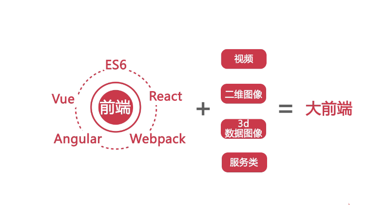
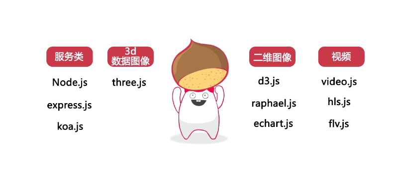
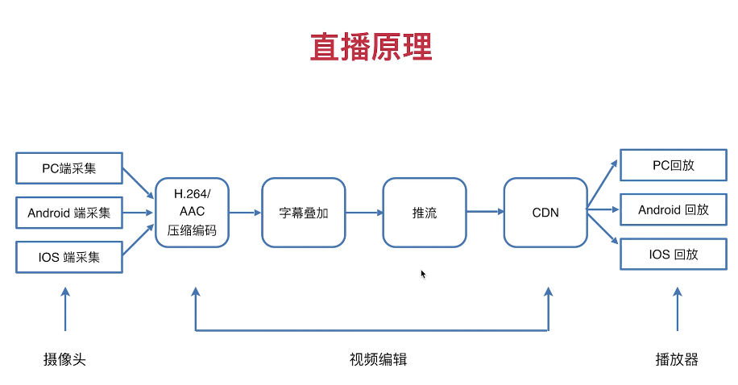

# 大前端





## 视频



### 视频格式

| 格式\浏览器 | Chrome | Fixfox | Safari |
| :---------: | :----: | :----: | :----: |
|     mp4     |   √    |   √    |   √    |
|    webm     |   √    |   √    |        |
|     hls     |        |        |   √    |
|     flv     |        |        |        |

### 直播协议

* HLS协议      
  * 好用，但有一定延时
  * 一般用于对延迟要求不高的，比如播放（斗鱼……）
* RTMP协议
  * 实时性相对比较好，但使用起来相对比较复杂
  * 一般用于客户端采集（主播录制）
* HTTP-FLV协议
  * 可以在一定程度上避免防火墙的干扰（例如，有的机房只允许80端口通过）
  * 可以很好的兼容HTTP 302 跳转，做到灵活调度
  * 可以使用 HTTPS 做加密通道
  * 很好的支持移动端（Android, IOS）

### video

#### 属性

| 属性          |                 |                   |
| :------------ | :-------------- | :---------------- |
| 贴图 poster   | 控制条 controls | 自动播放 autoplay |
| 循环播放 loop | 预加载 preload  | 音量 volume       |
| 播放地址设置  | 静音 muted      | 播放时间设置      |

```js
controls  // 显示控制条，提供用户控制，允许用户控制视频的播放，包括音量，跨帧，暂停/恢复播放。

controlslist  // 控制条显示的内容 （nodownload nofullscreen noremoteplayback）

preload // none: 提示作者认为用户不需要查看该视频，服务器最小化访问流量；提示浏览器该视频不需要缓存。
			 // metadata: 提示尽管作者认为用户不需要查看该视频，不过抓取元数据（比如：长度）还是很合理的。
			 // auto: 用户需要这个视频优先加载；如果需要的话，可以下载整个视频，即使用户并不一定会用它
			 // 空字符串：也就代指 auto 值
			 // 不设置，默认值就是浏览器定义的了
```

##### 基础用法

```html
<video src="./demo.mp4" width="300" height="500px" controls controlslist="nodownload nofullscreen"></video>
```

##### 切图

```html
<video src="./demo.mp4" width="300" height="500px" controls poster="./demo.png"></video>
```

##### 自动播放

```html
<video src="./demo.mp4" width="300" height="500px" autoplay controls poster="./demo.png"></video>
```

##### 静音

> 移动端自动播放，一定要在静音状态下

```html
<video src="./demo.mp4" width="300" height="500px" muted controls poster="./demo.png"></video>
```

##### 循环播放

```html
<video src="./demo.mp4" width="300" height="500px" loop muted controls poster="./demo.png"></video>
```

##### 预加载

```html
<video src="./demo.mp4" width="300" height="500px" preload controls poster="./demo.png"></video>
```

##### 音量控制

```html
<video id="_volume" src="./demo.mp4" width="300" height="500px" controls poster="./demo.png"></video>
<script type="text/javascript">
    let v = document.querySelector('#_volume')
    v.volume = 0.5
</script>
```

##### 播放时间控制

```html
<video id="_time" src="./demo.mp4" width="300" height="500px" controls poster="./demo.png"></video>
<script type="text/javascript">
    let v = document.querySelector('#_time')
    v.currentTime = 2   // （单位：秒）
    console.log(v.currentTime)
</script>
```

##### 播放地址的切换

```html
<video id="_src" src="./demo.mp4" width="300" height="500px" controls poster="./demo.png"></video>
<script type="text/javascript">
    let v = document.querySelector('#_src')
    setTimeout(function () {
        v.src = "./video1.mp4"
    }, 2000)
</script>
```

##### 备用地址切换

```html
<video id="_source" controls width="300" height="500">
    <source src="./demo1.mp4" type="video/mp4">
    <source src="./video1.mp4" type="video/mp4">
</video>
<script>
    let v = document.querySelector('#_source')
    setTimeout(function () {
        console.log(v.currentSrc)
    }, 1000)
</script>
```

#### 事件

| 事件         |            |              |            |
| ------------ | ---------- | ------------ | ---------- |
|              | 视频查找   | 时长变化     | 原数据加载 |
| 视频下载监听 | 可播放监听 | 播放监听     | 暂停监听   |
| 查找开始     | 查找结束   | 视频加载等待 | 视频结束   |

```html
<video id="vs" src="./demo2.mp4" width="500" height="300" preload controls controlslist="nodownload nofullscreen"></video>
<script>
    let v = document.querySelector('#vs')
    console.log('v.duration', v.duration)  // v.duration NaN
    // loadstart  在媒体开始加载时触发
    v.addEventListener('loadstart', function (e) {
        console.log('loadstart', v.duration)  // loadstart NaN
    })
    // durationchange  元数据已载入或已改变，表明媒体的长度发生了改变
    v.addEventListener('durationchange', function (e) {
        console.log('durationchange', v.duration) //durationchange 4.075
    })
    // loadedmetadata 媒体的元数据已经加载完毕，现在所有的属性包含了它们应有的有效信息
    v.addEventListener('loadedmetadata', function (e) {
        console.log('loadedmetadata')
    })
    // loadeddata  媒体的第一帧已经加载完毕
    v.addEventListener('loadeddata', function (e) {
        console.log('loadeddata')
    })
    // progress  告知媒体相关部分的下载进度时周期性地触发
    v.addEventListener('progress', function (e) {
        console.log('progress')
    })
    // canplay 在媒体数据已经有足够的数据（至少播放数帧）可供播放时触发
    v.addEventListener('canplay', function (e) {
        console.log('canplay')
    })
    // canplaythrough  表明媒体可以在保持当前的下载速度的情况下不被中断地播放完毕
    v.addEventListener('canplaythrough', function (e) {
        console.log('canplaythrough')
    })
    // play 在媒体回放被暂停后再次开始时触发
    v.addEventListener('play', function (e) {
        console.log('play')
    })
    // pause 在媒体回放被暂停后再次开始时触发
    v.addEventListener('pause', function (e) {
        console.log('pause')
    })
    // seeking  在跳跃操作开始时触发
    v.addEventListener('seeking', function (e) {
        console.log('seeking')
    })
    // seeked  在跳跃操作完成时触发
    v.addEventListener('seeked', function (e) {
        console.log('seeked')
    })
    // waiting 在一个待执行的操作（如回放）因等待另一个操作（如跳跃或下载）被延迟时触发
    v.addEventListener('waiting', function (e) {
        console.log('waiting')
    })
    // playing 在媒体开始播放时触发（不论是初次播放、在暂停后恢复、或是在结束后重新开始）
    v.addEventListener('playing', function (e) {
        console.log('playing')
    })
    // timeupdate 元素的currentTime属性表示的时间已经改变
    v.addEventListener('timeupdate', function (e) {
        console.log('timeupdate')
    })
    // ended 播放结束时触发
    v.addEventListener('ended', function (e) {
        console.log('ended')
    })
    // error 在发生错误时触发
    v.addEventListener('error', function (e) {
        console.log('error', e)
    })
</script>


mounted() {
      let videoH5 = this.$refs.videoH5
      videoH5.addEventListener('playing', (e) => {
        this.barrageOn = true
      })
    },

 <video class="h5-video"
             v-if="this.$root.$data.countDownLocation !== 2 || type === 'live' || this.$root.$data.countDownSec <= 0"
             :style="backImg"
             ref="videoH5"
             :src="video.url"
             :poster="browser === 'android'? '':video.poster"
             controls
             preload="auto"
             x5-video-player-type="h5"
             playsinline="true"
             x-webkit-airplay="true"
             webkit-playsinline="true"
             x5-video-orientation="landscape|portrait"></video>
```


### 播放器选型

#### video.js


#### hls.js

> 适用于hls协议的直播点播

#### flv.js


## 二维图像

## 3d数据图像

